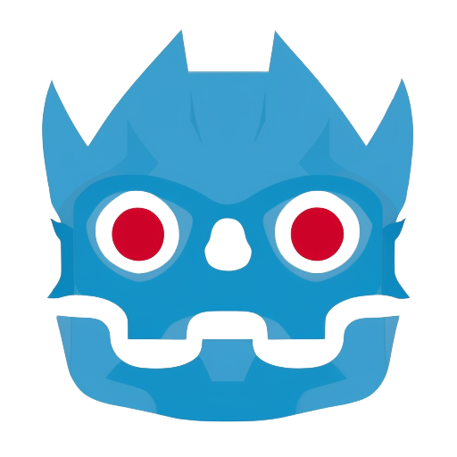

# Nodot
**A video game node library for Godot 4**

## What is Nodot?

Nodot is a 2D and 3D video game oriented collection of general purpose nodes for Godot 4. The goal is to provide a set of nodes that can be used to rapidly create a wide variety of games.

---

## Node Categories

### UI

#### Menus

- MenuContainer - A container for menus
- MainMenu - A generic main menu
- OptionsMenu - An options menu with general purpose options
- MultiplayerMenu - A menu for multiplayer options
- MultiplayerServerBrowser - A menu for a multiplayer server browser
- MultiplayerLobbyMenu - A menu for multiplayer lobbies

#### Interfaces

- PauseMenu - A pause menu with basic options
- Inventory - An interface for inventory management
- TechTree - An interface for a tech tree
- QuestLog - An interface for a quest log
- QuestProgress - An interface for quest progress
- Chat - A simple interface for multiplayer chat
- MiniMap - A simple interface for a mini map

### Scene Management

- SceneLoader - A node to manage scene loading
- LoadingScreen - A loading screen for scenes

### Networking

- NetworkManager - A simple network manager for multiplayer games

### Characters

#### Side Scroller

- SideScrollerCharacter - A node to create a side scroller character
- SideScrollerKeyboardInput - A node to handle side scroller keyboard input
- SideScrollerJoypadInput - A node to handle side scroller joypad input

#### Top Down

- TopDownCharacter - A node to create a top down character
- TopDownKeyboardInput - A node to handle top down keyboard input
- TopDownJoypadInput - A node to handle top down joypad input

#### First Person

- FirstPersonCharacter - A node to create a first person character
- FirstPersonKeyboardInput - A node to handle first person keyboard input
- FirstPersonJoypadInput - A node to handle first person joypac input
- FirstPersonMouseInput - A node to handle first person mouse input
- FirstPersonViewport - A node to create a first person viewport to support hands/items and UI

#### Third Person

- ThirdPersonCharacter - A node to create a third person character
- ThirdPersonKeyboardInput - A node to handle third person keyboard input
- ThirdPersonJoypadInput - A node to handle third person joypac input
- ThirdPersonMouseInput - A node to handle third person mouse input
  
### Vehicles

- Vehicle - A node to create a vehicle
- VehicleCamera - A node to add a vehicle camera
- VehicleKeyboardInput - A node to handle generic vehicle keyboard input
- VehicleJoypadInput - A node to handle generic vehicle joypad input
- VehicleMouseInput - A node to handle generic vehicle mouse input

#### Bike

- Bike - A node to create a bike
- BikeKeyboardInput - A node to handle bike keyboard input
- BikeJoypadInput - A node to handle bike joypad input
- BikeMouseInput - A node to handle bike mouse input

#### Car

- Car - A node to create a car
- CarKeyboardInput - A node to handle car keyboard input
- CarJoypadInput - A node to handle car joypad input
- CarMouseInput - A node to handle car mouse input

#### Boat

- Boat - A node to create a boat
- BoatKeyboardInput - A node to handle boat keyboard input
- BoatJoypadInput - A node to handle boat joypad input
- BoatMouseInput - A node to handle boat mouse input

#### Airplane

- Airplane - A node to create an airplane
- AirplaneKeyboardInput - A node to handle airplane keyboard input
- AirplaneJoypadInput - A node to handle airplane joypad input
- AirplaneMouseInput - A node to handle airplane mouse input

#### Spaceship

- Spaceship - A node to create a spaceship
- SpaceshipKeyboardInput - A node to handle spaceship keyboard input
- SpaceshipJoypadInput - A node to handle spaceship joypad input
- SpaceshipMouseInput - A node to handle spaceship mouse input

### AI

- LineOfSight2D - A 2D line of sight to detect nodes in line of sight
- LineOfSight3D - A 3D line of sight to detect nodes in line of sight
- ViewCone2D - A 2D view cone to detect nodes in line of sight within the limits of the cone
- ViewCone3D - A 3D view cone to detect nodes in line of sight within the limits of the cone

### Targetting

- HitScan2D - Simulate a fast object being fired at a target in 2D
- HitScan3D - Simulate a fast object being fired at a target in 3D
- Projectile2D - Simulate a slow moving object being fired at a target in 2D
- Projectile3D - Simulate a slow moving object being fired at a target in 3D
- HomingProjectile2D - Simulate a slow moving object that homes in on a target in 2D
- HomingProjectile3D - Simulate a slow moving object that homes in on a target in 3D

### Damage

- Damage - A node to apply damage
- Explosion2D - A 2D explosion area damage with line of sight
- Explosion3D - A 3D explosion area damage with line of sight
- DamageArea2D - 2D interval area damage
- DamageArea3D - 3D interval area damage

### Effects

- ImpactDecal3D - For adding bullet holes/blood splashes etc to 3D surfaces
- Pointer - A CanvasContainer that follows a 2D or 3D node
- HealthBar - A node to display a health bar
- Outliner2D - A node to outline 2D objects
- Outliner3D - A node to outline 3D objects
- Flash3D - A node to create a light flash and temporary effect such as a muzzle flash

### Environment

#### Elements

- Fire3D - A node to create 3D fire
- Fire2D - A node to create 2D fire
- Water3D - A node to create 3D water
- Water2D - A node to create 2D water

#### Nature

- Grass3D - A node to create 3D grass
- Grass2D - A node to create 2D grass

#### Interactive

- Breakable3D - A node to create 3D breakable objects
- Breakable2D - A node to create 2D breakable objects

### First Person

- FPSGun - A node to create a first person 3D gun or projectile weapon
- FPSIronSight - A node to position an ironsight camera
- FPSLeftHand - A node to attach a left hand to the weapon
- FPSRightHand - A node to attach a left hand to the weapon
- FPSArms - A node to attach 3D hands and arms to the weapon

### Sound

- SFXPlayer - A node to play sound effects
- MusicPlayer - A node to play music
- FootStepSounds - A node to manage and play footstep sounds
- EngineSound - A node to manage and play motor engine sounds

### Utilities

- SaveGame - A node to save and load game data
- StateMachine - A node to create a simple state machine